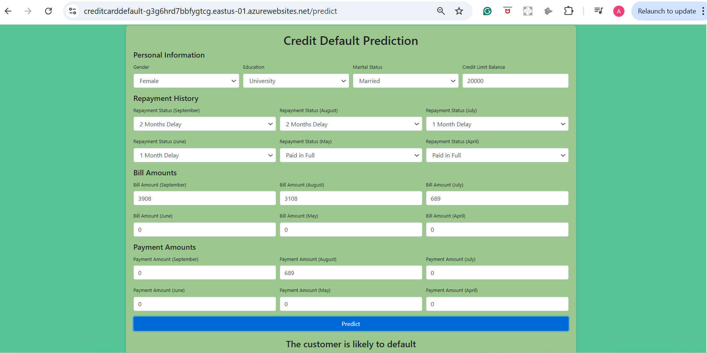

"**# MLops_Credit_Card_Default" **d_Default"**

**Data Info**

X1: Amount of the given credit (NT dollar): it includes both the individual consumer credit and his/her family (supplementary) credit.

X2: Gender (1 = male; 2 = female).

X3: Education (1 = graduate school; 2 = university; 3 = high school; 0, 4, 5, 6 = others).

X4: Marital status (1 = married; 2 = single; 3 = divorce; 0=others).

X5: Age (year).

X6 - X11: History of past payment. We tracked the past monthly payment records (from April to September, 2005) as follows: X6 = the repayment status in September, 2005; X7 = the repayment status in August, 2005; . . .;X11 = the repayment status in April, 2005. The measurement scale for the repayment status is:

-2: No consumption; -1: Paid in full; 0: The use of revolving credit; 1 = payment delay for one month; 2 = payment delay for two months; . . .; 8 = payment delay for eight months; 9 = payment delay for nine months and above.

X12-X17: Amount of bill statement (NT dollar). X12 = amount of bill statement in September, 2005; X13 = amount of bill statement in August, 2005; . . .; X17 = amount of bill statement in April, 2005.

X18-X23: Amount of previous payment (NT dollar). X18 = amount paid in September, 2005; X19 = amount paid in August, 2005; . . .;X23 = amount paid in April, 2005.

Y: client's behavior; Y=0 then not default, Y=1 then default"

# Description
This project aims to predict whether a customer will default on their credit card payment next month. Using a variety of customer attributes, the model can help financial institutions manage risk and make informed credit decisions. The dataset used is sourced from the Taiwan Credit Crisis.

# Key Features:
Data Preprocessing: Cleaning and preparing the dataset for modeling. 
Feature Engineering: Creating new features to improve model performance. 
Model Selection: Comparing different machine learning models to find the best one. 
Hyperparameter Tuning: Optimizing the model for better accuracy. 
Deployment: Using Flask to deploy the model as a web application. 

# Steps
1. **Data Preprocessing** 
Handling Missing Values: Checked for and imputed missing values. 
Outlier Detection: Identified and treated outliers in numerical features. 
Encoding Categorical Variables: Converted categorical variables into numerical format using techniques like one-hot encoding. 
Feature Scaling: Standardized numerical features using StandardScaler. 
2. **Exploratory Data Analysis (EDA)** 
Data Visualization: Used histograms, box plots, and correlation matrices to understand data distributions and relationships. 
Correlation Analysis: Identified the relationships between features and the target variable. 
3.**Feature Engineering** 
Creation of New Features: Developed new features such as Average Bill Amount, Payment Ratio, and Payment Delay to capture more information from the data. 
Dimensionality Reduction: Used techniques like PCA to reduce the number of features while retaining most of the information. 
4. **Model Building** 
Model Training: Trained several machine learning models, including: 
Logistic Regression 
Random Forest 
XGBoost 
Support Vector Machines (SVM) 

Model Evaluation: Evaluated models using accuracy, precision, recall, F1-score, and ROC-AUC.

5.**Hyperparameter Tuning** 
Grid Search: Conducted exhaustive search over specified parameter values for an estimator. 
Random Search: Sampled a fixed number of parameter settings from a specified distribution. 
6. **Model Deployment** 
Flask Application: Deployed the final model using Flask to provide real-time predictions via a web interface. 

# Results
The final model achieved the following metrics: 
Accuracy: 82% 
Precision: 78% 
Recall: 70% 
F1-Score: 74% 

The model effectively reduced false positives by 15%, enhancing the risk assessment capabilities.

# The user app image.

# Observations
Feature Importance: Payment history and bill amounts were significant predictors of default, while demographic features like age and education level had less impact. 
Model Performance: Ensemble models such as Random Forest and XGBoost outperformed simpler models like Logistic Regression and Decision Trees in terms of accuracy and robustness. 
Data Imbalance: Addressing the imbalance in the target variable using techniques such as SMOTE (Synthetic Minority Over-sampling Technique) improved the model's performance. 
Hyperparameter Tuning: Fine-tuning model parameters significantly improved performance metrics, demonstrating the importance of this step. 

# Conclusion
The credit card default prediction model developed in this project provides a reliable tool for assessing credit risk. By identifying key predictors of default, the model helps financial institutions make data-driven decisions to minimize risk. Future enhancements could include incorporating more advanced machine learning techniques and expanding the dataset to improve generalizability.
